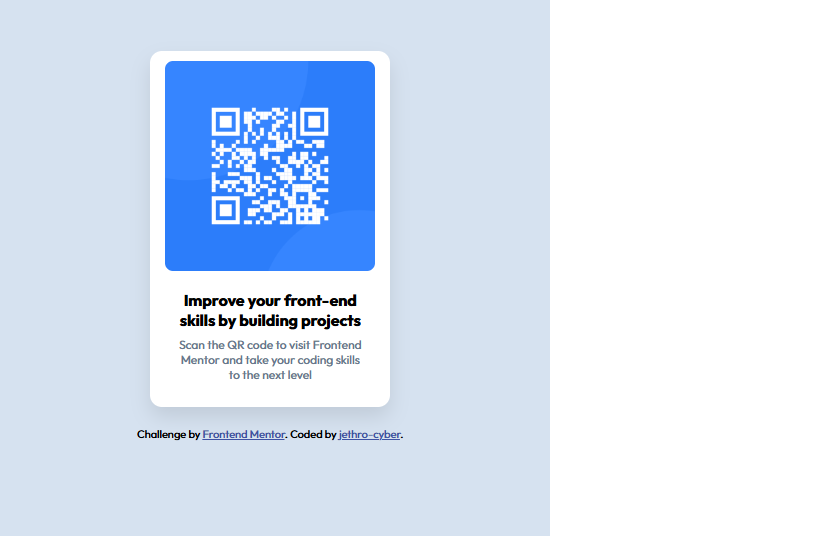

# Frontend Mentor - QR code component solution

This is a solution to the [QR code component challenge on Frontend Mentor](https://www.frontendmentor.io/challenges/qr-code-component-iux_sIO_H). Frontend Mentor challenges help you improve your coding skills by building realistic projects.

## Table of contents

- [Overview](#overview)
  - [Screenshot](#screenshot)
  - [Links](#links)
- [My process](#my-process)
  - [Built with](#built-with)
  - [What I learned](#what-i-learned)
  - [Continued development](#continued-development)
  - [Useful resources](#useful-resources)
- [Author](#author)
- [Acknowledgments](#acknowledgments)

## Overview

### Screenshot

### Links

- Solution URL: [Add solution URL here](https://github.com/jethro-cyber/profile-card)
- Live Site URL: [Add live site URL here](https://jethro-cyber.github.io/profile-card/)

## My process

### Built with

- Semantic HTML5 markup
- CSS custom properties
- Flexbox
- CSS Grid

### What I learned

I learned how to:

- use semantic HTML structure
- center elements using flexbox
- work with padding, margins, and border-radius
  -Apply custom fonts

### Continued development

I want to improve more on:

- responsiveness
- Using variables in CSS

### Useful resources

- [fontshare](https://www.fontshare.com/fonts/outfit) - This is where i got the outfit font used in this project.

## Author

- GitHub - [@jethro-cyber](https://www.github.com/jethro-cyber)
- Frontend Mentor - [@jethro-cyber](https://www.frontendmentor.io/profile/jethro-cyber)

## Acknowledgments

I'd like to thank **Frontend Mentor** for providing this great challenge. Also, thanks to **fontshare** for tech free outfit font i used in the project
